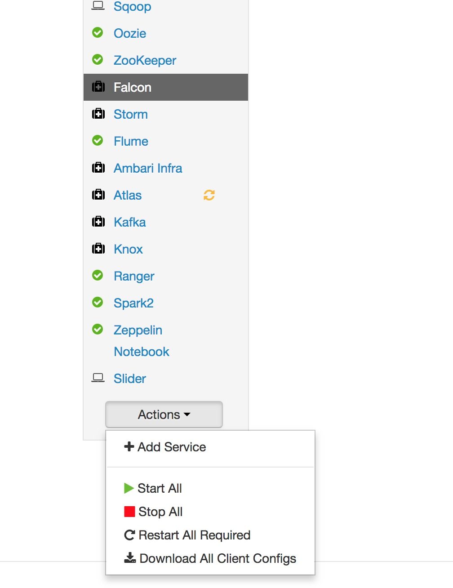
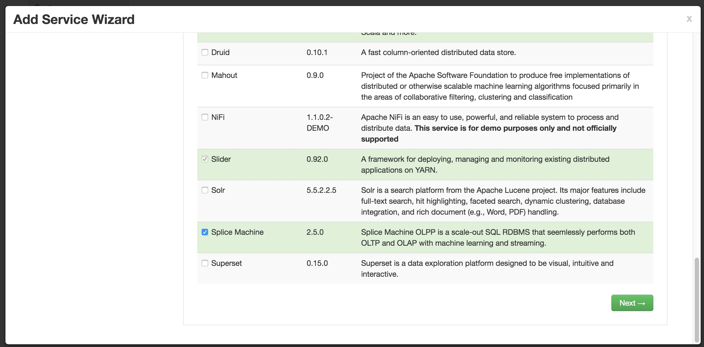
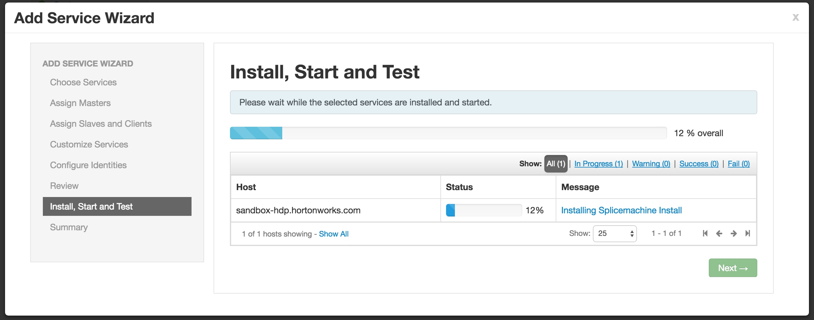
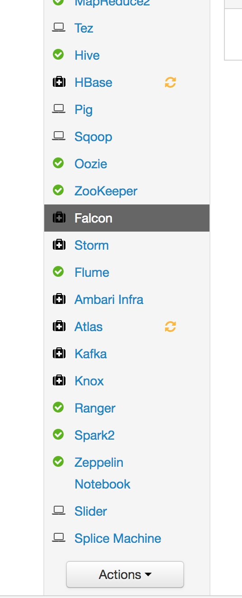

# splice-ambari-service
An Apache Ambari Service For Splice Machine

#### Steps to deploy to HDP Virtual Machine.

1) Download HDP Sandbox for VirtualBox. https://hortonworks.com/tutorial/sandbox-deployment-and-install-guide/section/1/
2) Start Virtual Machine.
3) Log into virtual machine.

```
ssh root@127.0.0.1 -p2222
initial password hadoop
```

4) Get latest ambari service branch to test, install, and restart Ambari Server.

```
git clone git@github.com:splicemachine/splice-ambari-service.git
cd splice-ambari-service
rm -Rf /var/lib/ambari-server/resources/stacks/HDP/2.6/services/SPLICEMACHINE
mkdir /var/lib/ambari-server/resources/stacks/HDP/2.6/services/SPLICEMACHINE
cp -Rf * /var/lib/ambari-server/resources/stacks/HDP/2.6/services/SPLICEMACHINE
ambari-server restart 
```

5) Access the Ambari server UI.

```
http://127.0.0.1:8080/#/main/dashboard/metrics
```










